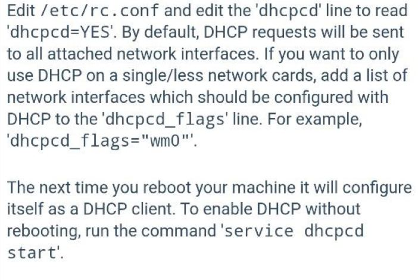

# Гайд на лаобраторную работу номер 1

Думаю на этом этапе у вас пока что еще ничего нет. Первое, что нужно сделать - поставить `VirtualBox`. Как это делать - я писать не буду, это совсем несложно. Так что в гайдах начну сразу с создания виртуальной машины.

## ReactOS

Как билдить образ - разбирайтесь сами, для этого есть [официальная документация](https://reactos.org/wiki/Building_ReactOS), там все достаточно подробно написано, так что дублировать не вижу смысла.

Скажу, лишь, что под `Intel` + `Windows` у меня все получилось, причем с первого раза, а также, что вам вряд ли нужен `livecd` образ (они позволяют загрузить систему прямо с диска/флешки), так что его можно не билдить, хотя он указан в TL;DR.

### Внимание
Пункты 12-13 делать не обязательно, главное при старте операционной системы загружаться не с установочного диска, вроде как нужно просто не нажимать никакие клавиши пару секунд при старте (это будет написано, так что можете не париться).

### Добавление вывода имени и фамилии
1) Заходим в исходники `ReactOS` (вы их выкачали с помощью `git`)
2) Заходим в файл `ntoskrnl/kd64/kdinit.c`
3) переходим на строку 76 (примерно) и туда пишем что-то в духе
```C
DPRINT1("Imya Familia\n");
```

К этому моменту у вас должен быть собранный вами образ `ReactOS` c выводом дом инфы в логи и поставленный `VirtualBox`

### Создание виртуальной машины и ее настройка
1) Машина
2) Создать (или просто `Ctrl+N`)
3) Имя и папку надо придумать самому, как и папку
В поле _образ ISO_ надо поставить собранный нами `bootcd.iso` файл
Тип: _Other_
4) Оперативы я дал 8 гб
5) Выбираем создать новый виртуальный жесткий диск 
размер диска - я даже не задумывался и поставил 20 Гб, все равно я потом ее удалю 😁. Если такой возможности нет - думаю в доке написано сколько надо минимум поставить для полноценной работы системы.
6) Готово
7) Запускаем виртуальную машину 
8) Выбираем язык нашей операционной системы
9) дальше мне было лень читать и я тупо везде кликал Enter
10) У вас поставится ОС и машина перезапустится, далее начнется установка "с окошками", а не тупо в консоли, там опять можно прокликать `Enter` и нажать установить какой-то пакет
11) После этого машина опять перезагрузится, надо ее выключить, причем без сохранения состояния (скорее всего клавиатура захвачена и мышь тоже, нажмите правый Ctrl)
12) Зайдите в настройки виртуалки (как это сделать написано на абзац ниже)
13) Носители
14) Берем и отключаем iso образ (правая кнопка мыши -> удалить устройство)

### Вывод логов в файл
Про это можно почитать вот [тут](https://stackoverflow.com/questions/38915802/how-can-i-collect-logs-from-linux-running-in-virtualbox-in-an-external-file)
Если просто и на русском:
1) Кликаем правой кнопкой мыши по созданной виртуалке
2) Настройки
3) `COM` - порты (у меня это 4 снизу пункт меню слева)
4) Порт 1, ставим галочку включить
5) Выбираем номер порта `COM1`
Режим: _перенаправлен в файл_
Далее указываете путь, например у меня это `C:\ReactOSLab1\serial.log`

## NetBSD

1. Установка виртуальной машины проводится абсолютно также, как и для `ReactOS`, просто берем нужный нам iso файл например [отсюда](https://ftp.netbsd.org/pub/NetBSD/iso/)

2. логи ставим также (я про COM1 и файл), но будет прикол, что работать они не будут, пока мы не настроим их (ахуенно)

3. первый запуск - я лично все быстро прокликал и все, можете посмотреть хз у индусов бля гайды как ставить эту залупку

4. убираем iso и запускаем, нас попросит войти, нам похуй, вводим логин root и все

5. дальше начинается настройка, настроим логи
нам нужно открыть файл /etc/syslog.conf и написать туда строку
kern.* /dev/tty00 (перенаправляем логи на COM1)
для этого можно юзать vim, да, это жестко
```bash
vi /etc/syslog.conf
```
для перехода в интерактивный режим жмем I
пишем строку
жмем esc
пишем :wq
enter

6. теперь нам надо врубить dhcp

и еще я для этого поставил второй параметр в сети в virtual box
там будет что-то в духе сетевой мост

Типа
Открываем настройки машины
Сеть
Адаптер 1
Тип подключения у меня стоит сетевой мост

7. 
нам надо выкачать всю хуйню (исходники netbsd)

https://www.netbsd.org/docs/guide/en/chap-fetch.html#chap-fetch-cvs
Я сделал тупо 32.4.1

Если что, делать ток релиз можно, без stable
И только src, без xsrc

8. 
надо поменять сам код 
(да, опять vim)
файл
/usr/src/sys/kern/init_main.c

вставляем в самый конец (Esc + shift + G) на какое-то место, куда поставил я покажу на фотке
(*pr)("\n%s\n", "dhdh") ;

9. Билдим..
cd /usr/src/sys/arch/amd64/conf 
cp GENERIC MYKERN && config MYKERN
cd ../compile/MYKERN && make depend && make 
mv /netbsd /netbsd.old && mv netbsd /

10. 